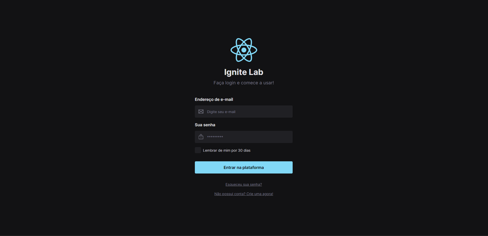

# Ignite lab 2022



* `npm create vite@latest`
* `npm install -D tailwindcss postcss autoprefixer`
  * `npx tailwindcss init -p`
  * global.css : 
  ```css
    @tailwind base;
    @tailwind utilities;
    @tailwind components;
  ```
* Add inter font in index.html:

```html
<link rel="preconnect" href="https://fonts.googleapis.com" />
<link rel="preconnect" href="https://fonts.gstatic.com" crossorigin />
<link href="https://fonts.googleapis.com/css2?family=Inter:wght@400;600;700&family=Mochiy+Pop+P+One&display=swap" rel="stylesheet" />
```

* StoryBook (doc) 
  * `npx storybook init --builder @storybook/builder-vite --use-npm`
  * `npm run storybook`

* clsx - conditional in tailwind `npm install --save clsx`

* Radix Slot `npm install @radix-ui/react-slot`

* phosphor React - `npm install phosphor-react`
* Radix checkbox `npm install @radix-ui/react-checkbox`

* Deploy - `npm i @storybook/storybook-deployer --save-dev`
  * add package.json - `"deploy-storybook": "storybook-to-ghpages"`
  * [doc](https://github.com/storybookjs/storybook-deployer)
  * deploy Storybook in [https://henrickyl.github.io/igniteLab-design-system-react/](https://henrickyl.github.io/igniteLab-design-system-react/)
  * accessibility on Storybook - `npm install @storybook/addon-a11y`

* Storybook Interactions - `npm install -D @storybook/addon-interactions @storybook/jest @storybook/testing-library @storybook/test-runner`
  * storybook/main add - `interactionsDebugger: true,`
  * test-storybook - `test-storybook --watch`

* axios - `npm install axios`

* Mock - Mock Service Worker - `npm i msw msw-storybook-addon -D`
  * `npx msw init public/`


[](https://henrickyl.github.io/igniteLab-design-system-react/)